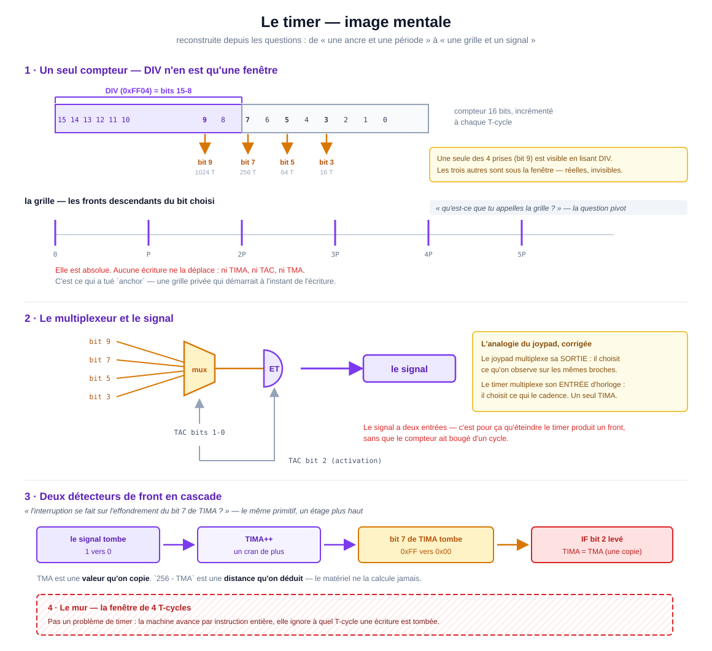

# Le timer — comment le modèle s'est construit



Ce document n'explique pas le timer. Il explique le **chemin** pour y arriver : quelles
approximations ont servi de prise, lesquelles ont dû sauter, et à quel moment.

L'ordre est celui des questions, pas celui de la doc.

---

## Le point de départ : une ancre et une période

Le premier modèle, celui du code d'origine :

> Quand on écrit TAC ou TIMA, on pose une ancre. À chaque lecture, TIMA vaut
> `(temps écoulé depuis l'ancre) / période`, la période venant des deux bits bas de TAC.

Il n'est pas absurde — il donne la bonne **cadence**. Il produit même des tests verts
tant qu'on n'écrit qu'au compteur zéro. C'est un modèle de *durée* : on mesure un
intervalle depuis un événement.

Le matériel, lui, n'a pas de modèle de durée. Il a un modèle de **position**.

---

## Premier dégrossissage : les bits d'un compteur qui monte

Approximation apportée en observant un compteur binaire :

> Si on regarde comment chaque bit évolue, chacun reste fixé à 0 ou 1 pendant `2^n`
> lignes. Le bit 0 alterne, le bit 3 reste à 0 pendant 8 puis à 1 pendant 8.

C'est juste, et c'est la bonne porte d'entrée. Il manquait un facteur 2 : un cycle
complet dure `2^(n+1)`, donc il n'y a qu'**un seul front descendant** par `2^(n+1)`.
De là sort toute la table des périodes.

Ce qu'il faut retenir : le matériel ne compte pas, il **surveille un fil qui existe déjà**.
Un multiplexeur choisit lequel, un détecteur regarde s'il vient de tomber. C'est tout
le timer.

---

## La question pivot : « qu'est-ce que tu appelles la grille ? »

C'est elle qui a fait tomber l'ancre.

La grille, c'est l'ensemble des positions du compteur où un front se produit : les
multiples de `P`. Elle ne dépend de rien d'autre que du compteur. Aucune écriture
ne la déplace.

```
vraie grille  : |           |           |           |
                0           P          2P          3P

grille privée :             |           |           |
d'une ancre                ancre     ancre+P    ancre+2P
```

Elles ne coïncident que si on écrit pile sur un multiple de `P`. Le reste du temps,
l'ancre décale tous les fronts du reliquat en cours.

D'où la substitution qui a tout réglé : **`anchor` (un instant) devient
`cranBase = floor(C / P)` (une position)**. `floor` aligne sur la grille ; une
soustraction d'instants ne le fait pas.

---

## L'analogie du joypad, et sa correction

Proposée pour comprendre le multiplexeur :

> Le timer multiplexe son TIMA, comme le joypad multiplexe son nibble bas ?

Même primitive (N vers 1), place opposée dans le circuit :

| | multiplexe quoi | effet |
|---|---|---|
| **Joypad** | la **sortie** | choisit ce qu'on *observe* sur les mêmes broches |
| **Timer** | l'**entrée d'horloge** | choisit ce qui le *cadence* |

Il n'y a qu'**un seul TIMA**. Changer les bits 1-0 de TAC ne bascule pas vers un autre
compteur : ça rebranche une autre horloge sous le même. Si l'ancien fil valait 1 et le
nouveau 0, la sortie du ET tombe — front parasite, TIMA gagne un cran alors qu'on
voulait juste changer de fréquence.

---

## L'analogie `setTimeout` / `setInterval`

Proposée pour cadrer l'usage côté jeu, et défendue à raison :

> L'écart entre deux callbacks est le même ; la répétition est orthogonale.
> Le concept d'avance sur TIMA vaut autant pour un tir isolé que pour une récurrence.

Exact. Un one-shot, côté GB, c'est un intervalle qu'on annule en éteignant TAC dans le
handler. Le calcul ne change pas.

Ce qui reste réellement asymétrique n'est pas la répétition mais **la propriété du t=0**.
`setTimeout` démarre son décompte à l'appel : on possède l'origine. Écrire TAC ne démarre
rien — la grille tournait déjà. Le premier intervalle vaut donc
`(256 - TMA) * P` *moins la phase déjà consommée*.

Le geste d'initialisation classique (`TIMA = TMA` puis reset de DIV) n'est rien d'autre
que **s'approprier le t=0**, reprendre à la main ce que `setTimeout` donne gratuitement.

---

## Ce qui a résisté

### TMA contre `256 - TMA`

Inversion revenue trois fois. La formulation qui a fini par tenir :

> **TMA est une valeur qu'on copie. `256 - TMA` est une distance qu'on déduit.**

Au rechargement, le matériel ne calcule rien — il recopie l'octet TMA dans TIMA.
`256 - TMA` est *notre* arithmétique, pour prédire le prochain débordement. La machine
ne la fait jamais.

Répartition des rôles :

- **TAC** fixe l'**espacement** des barres : 16, 64, 256 ou 1024 T-cycles.
- **TMA** fixe **combien de barres** par interruption : de 1 à 256.
- Période d'interruption = `(256 - TMA) * P`. L'interruption tombe toujours **sur** une
  barre, jamais entre deux.

### Les unités

Deux décalages qui s'additionnent, et qui ont produit plusieurs faux départs :

1. La doc compte en **T-cycles**, le code comptait en **cycles machine** — facteur 4,
   soit 2 bits d'écart sur les indices.
2. Le front d'un bit `n` tombe tous les `2^(n+1)`, pas tous les `2^n`.

D'où : `256` cycles machine = `1024` T = `2^10` → **bit 9**. Le fichier compte
désormais en T-cycles de bout en bout pour que les indices collent à la doc.

### Deux photos prises au même instant

Confusion tenace entre deux gestes qui vivent tous deux dans les setters :

| | ce qu'elle photographie | pourquoi |
|---|---|---|
| `_capture()` | la **valeur** de TIMA | ne pas la perdre quand le référentiel change |
| le signal (avant/après) | le **bit** `compteur ET activation` | détecter un front qui va peut-être ajouter 1 |

L'une conserve, l'autre déclenche.

---

## L'observation qui structure tout : la cascade

> L'interruption se fait sur l'effondrement du bit 7 de TIMA ?

Oui — et c'est **le même primitif, un étage plus haut**. Le timer est une cascade de
deux détecteurs de front :

```
bit N du compteur ET activation   tombe  ->  TIMA++
bit 7 de TIMA                     tombe  ->  IF bit 2 + TIMA = TMA
```

Une seule réserve : le front doit venir d'un **incrément**, pas d'une écriture. Écrire
`0x00` dans TIMA alors qu'il valait `0x80` fait tomber le bit 7 sans qu'aucune
interruption ne soit due.

---

## Le mur

La fenêtre de 4 T-cycles au débordement — TIMA qui doit lire `0x00`, l'écriture qui
l'annule, l'écriture de TMA qui change la valeur rechargée — **n'est pas un problème
de timer**.

`machine/index.js` fait `totalCycles += cost` par instruction entière et n'appelle
`check()` qu'entre deux instructions. La machine ne sait pas à quel T-cycle, dans
l'instruction, une écriture est tombée. Aucune refonte du timer ne peut inventer cette
information.

C'est aussi pourquoi une suite de tests bâtie sur un modèle *push* (`tick()` par
T-cycle) échouait en bloc : elle n'était pas en avance sur le timer, elle était en
avance sur la **machine**.

---

## État du modèle

| | |
|---|---|
| **DIV** | l'horloge réinitialisable — une fenêtre sur les bits 15-8 du compteur |
| **TIMA** | le compteur qui déborde et lève l'interruption |
| **TAC** | activation + choix de la prise (l'espacement des barres) |
| **TMA** | la valeur plancher recopiée au rechargement (le nombre de barres) |

Un seul compteur. Une grille absolue. Un signal à deux entrées. Deux détecteurs en
cascade. Et un mur, qui n'est pas ici.
